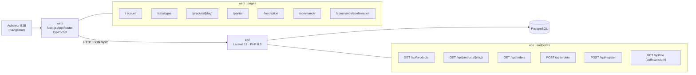
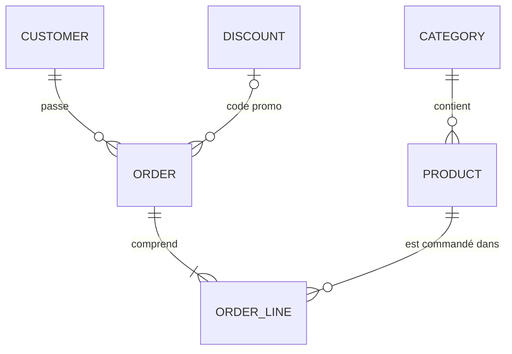
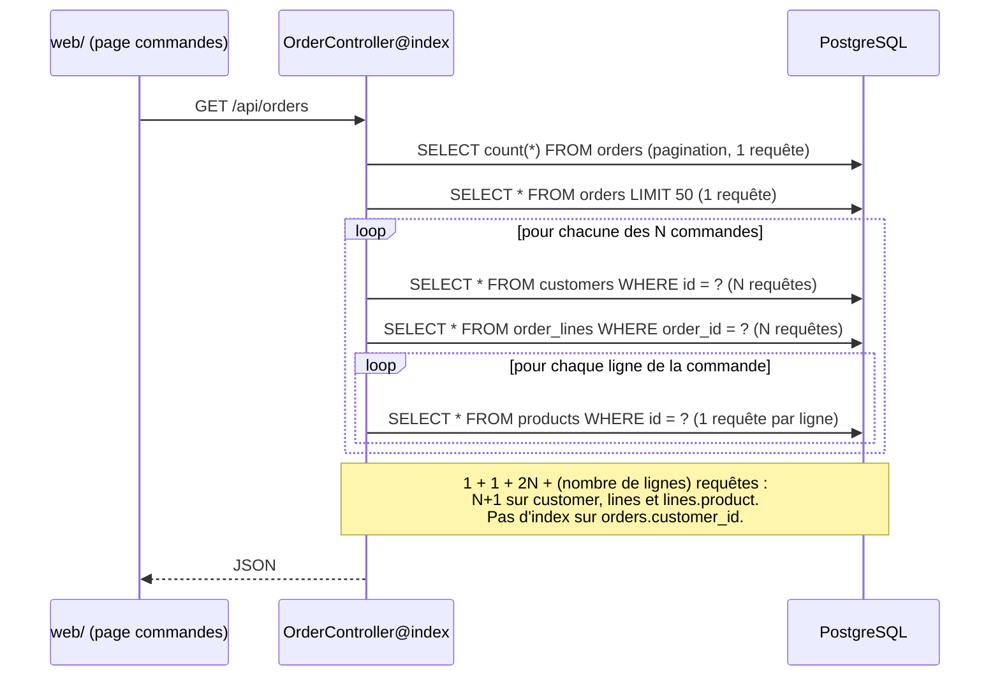
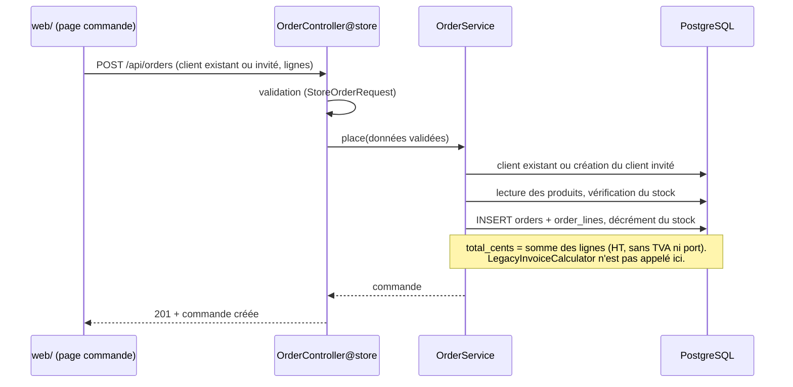
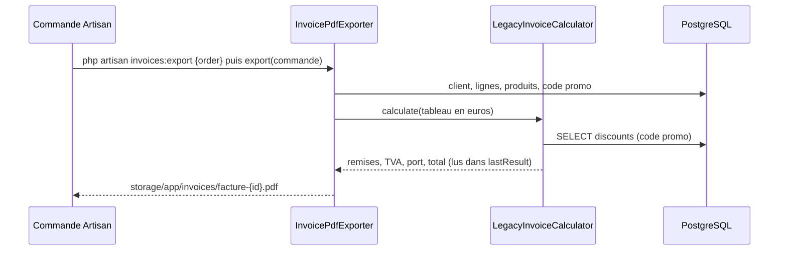

# Architecture de comptoir

Document produit en séance 1 (exercice 1), relu et corrigé à la main. Destination dans le
dépôt : `docs/architecture.md`. Les schémas sont en Mermaid : ils s'affichent sur GitHub et
GitLab, dans un Artifact Claude.ai ou sur mermaid.live.

## Vue d'ensemble

## Modèle de données

Discount est lié à Order par le code promo : `orders.discount_code` référence `discounts.code`,
sans contrainte de clé étrangère (lien logique, vérifié dans les migrations).

## Flux : consultation des commandes (point fragile)

## Flux : création de commande

## Flux : export de facture

## Points fragiles

| Zone | Constat | Risque | Séance où on le traite |
|---|---|---|---|
| `GET /api/orders` | N+1 sur `lines`, `lines.product` et `customer` ; index manquant sur `orders.customer_id` | Temps de réponse qui croît avec le volume | S3 |
| `app/Services/LegacyInvoiceCalculator.php` | ~400 lignes, remises, TVA et arrondis mêlés, aucun test | Régression silencieuse sur les montants | S3, S5 |
| `POST /api/orders` | Montants calculés côté serveur, écriture en base | Incohérence de totaux, validation incomplète | S4, S5 |
| Front `web/` | Pages publiques (catalogue, fiche produit) | SEO et performances | S7 |
